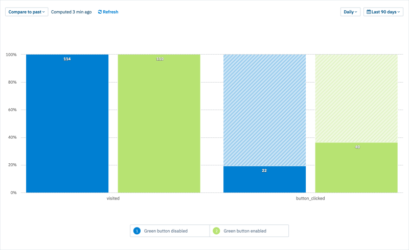

# How to implement and visualize an A/B test using ConfigCat and Amplitude 

The purpose of this sample is to demonstrate how to implement an A/B testing scenario
using ConfigCat. And how to visualize the A/B test results as a funnel using Amplitude. [Here is the blog post](https://configcat.com/blog/2022/04/08/amplitude-abtest/) with more details.




### Run the sample locally:
To run the sample project you need [Angular CLI](https://cli.angular.io/) installed
```
npm install -g @angular/cli
```

1. Install dependencies
```
npm install
```
2. Run sample app
```
ng serve
```
3. Open browser at `http://localhost:4200/`

## Learn more

[**ConfigCat**](https://configcat.com) also supports many other frameworks and languages. Check out the full list of supported SDKs [here](https://configcat.com/docs/sdk-reference/overview/)

You can also explore other code samples for various languages, frameworks, and topics here in the [ConfigCat labs](https://github.com/configcat-labs) on GitHub.

Keep up with ConfigCat on [Twitter](https://twitter.com/configcat), [Facebook](https://www.facebook.com/configcat), [LinkedIn](https://www.linkedin.com/company/configcat/), and [GitHub](https://github.com/configcat).

## Author
[Gergely Sinka](https://github.com/sigewuzhere)
[Peter Csajtai](https://github.com/z4kn4fein)

## Contributions
Contributions are welcome!
